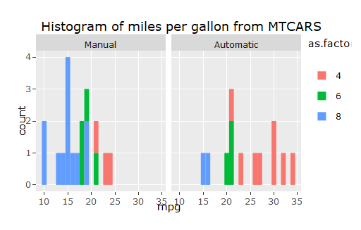

```{r setup, include=FALSE}
knitr::opts_chunk$set(echo = FALSE)
```

## Data Product Project 2

Create a web page presentation using R Markdown that features a plot created with Plotly. Host your webpage on either GitHub Pages, RPubs, or NeoCities. Your webpage must contain the date that you created the document, and it must contain a plot created with Plotly.


## Slide with R Output

```{r cars, echo = TRUE}
data(mtcars)
library(ggplot2)
library(plotly)

mtcars$cyl <- as.factor(mtcars$cyl)
mtcars$am <- factor(mtcars$am, labels = c("Manual", "Automatic"))
g <- ggplot(mtcars, aes(mpg, fill = as.factor(cyl)))+
  geom_histogram(binwidth = 1) + 
  ggtitle("Histogram of miles per gallon from MTCARS") +
  facet_wrap(~am) 
ggplotly(g)
```

## Slide with Plot


```{r}

```

